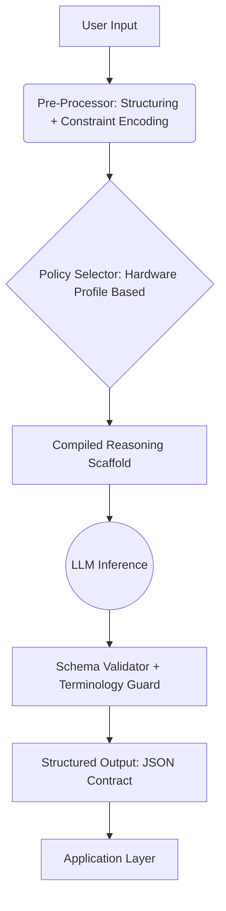
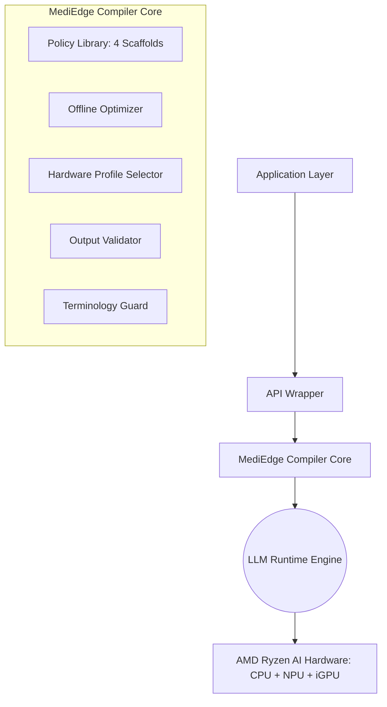

# AMD Slingshot Submission: MediEdge Compiler (ACPC Core)

## 1. Brief About the Idea

**MediEdge Compiler (ACPC Core)** is a deterministic inference optimization layer that transforms raw LLM outputs into stable, structured, low-latency reasoning pipelines optimized for edge deployment on AMD Ryzen AI devices.

Instead of modifying the model, MediEdge compiles optimized reasoning scaffolds offline and enforces structured output contracts at runtime.

This reduces:
* Token overhead
* Latency
* Output variance
* Integration instability

It enables reliable, offline AI inference on affordable edge hardware without cloud dependency.

---

## 2. Opportunities

### Market Opportunity
* Edge AI adoption is accelerating.
* Enterprises want privacy-first on-device AI.
* LLM inference on edge is unstable and compute-heavy.

### Domain Opportunities
Initial vertical: Rural healthcare decision-support.
Expansion:
* Legal reasoning assistance
* Industrial troubleshooting systems
* Structured compliance auditing
* Field diagnostics

### Hardware Opportunity
AMD Ryzen AI laptops are becoming affordable compute platforms.
Optimizing inference efficiency increases viability of:
* On-device AI assistants
* Enterprise private AI systems
* Low-power deployment environments

---

## 3. How Different Is It From Existing Solutions?

| Existing Approach | Limitation |
| :--- | :--- |
| Fine-tuning | Expensive, privacy-sensitive, model-specific |
| Prompt engineering | Manual, unstable, non-deterministic |
| Model quantization | Reduces size but not reasoning instability |
| RAG pipelines | Adds retrieval, doesn’t fix reasoning variance |

**MediEdge difference:**
* Model-agnostic
* No retraining
* Deterministic reasoning scaffolds
* Offline optimized
* Zero runtime overhead
* Hardware-aware profile selection

It optimizes *inference control*, not model weights.

---

## 4. How It Solves the Problem

**Problem:**
LLMs on edge devices show variability, high token usage, and unstable structure.

**Solution:**
1. Compile optimized reasoning templates offline.
2. Select hardware-appropriate scaffold at runtime.
3. Enforce strict structured output schema.
4. Reduce token count through controlled reasoning depth.
5. Validate output for structural compliance.

**Result:**
* Stable outputs
* Reduced compute
* Predictable latency
* Integration-ready responses

---

## 5. USP (Unique Selling Proposition)

✔ Deterministic inference control layer
✔ Model-agnostic deployment
✔ Hardware-profile-based scaffold selection
✔ 20–30% token reduction without retraining
✔ 25%+ reduction in output variance
✔ Zero cloud dependency
✔ Compatible with AMD heterogeneous compute stack

This is a systems-level innovation, not a prompt tweak.

---

## 6. Features Offered

* Offline scaffold optimizer (12 configuration grid search)
* Hardware profile selector
* Structured JSON contract enforcement
* Terminology guardrails
* Reasoning depth control
* Variance measurement engine
* Token efficiency monitor
* Plug-and-play API wrapper
* Fully offline execution mode
* Benchmark dashboard

---

## 7. Process Flow Diagram

---

## 8. Use-Case Diagram (Healthcare Example)

**Actors:**
* Doctor
* MediEdge Compiler
* Local LLM Engine

**Flow:**
1. Doctor inputs patient case.
2. MediEdge selects optimized scaffold.
3. LLM generates structured differential reasoning.
4. Output validated.
5. Doctor reviews structured recommendation.
6. Final decision remains with doctor.

*Important: Decision authority is human-controlled.*

---

## 9. Wireframe (Conceptual UI Mock)

**Screen 1:**
* Case Input Field
* “Run Structured Analysis” Button
* Hardware Profile Indicator

**Screen 2:**
* Structured Output Sections:
  * Symptoms Summary
  * Differential Diagnosis
  * Rule-out Reasoning
  * Confidence Level
* Token Usage Display
* Latency Display

**Screen 3:**
* Stability Metrics Dashboard
  * Token reduction %
  * Variance score
  * Schema compliance %

---

## 10. Architecture Diagram

*No retraining. No cloud. No additional model weights.*

---

## 11. Technologies to Be Used

**Programming:**
* Python
* FastAPI (API layer)

**LLM Runtime:**
* Ollama / llama.cpp
* Open-source LLM (quantized)

**Optimization:**
* Grid search evaluation engine
* JSON schema validation

**Benchmarking:**
* Latency measurement
* Token tracking
* Variance computation

**Frontend:**
* React or lightweight dashboard

**Deployment:**
* Fully offline package

---

## 12. Usage of AMD Products/Solutions

**Target Hardware:**
AMD Ryzen AI laptops with:
* CPU
* Integrated GPU
* NPU (XDNA architecture)

**Alignment:**
* Reduced token count lowers NPU compute cycles.
* Stable structured output improves edge application viability.
* Hardware-aware profile selection optimizes for power envelope.

**Future:**
* NPU-specific scaffold tuning.
* Heterogeneous workload partitioning.
* Power-aware scheduling.

---

## 13. Estimated Implementation Cost (Prototype)

**Development:**
* Solo developer
* 4–6 weeks

**Hardware:**
* AMD Ryzen AI laptop (~₹70,000–₹1,00,000)

**Software:**
* Open-source stack
* No licensing cost

**Total prototype cost:** ₹1–1.5 Lakhs

---

## 14. Prototype Assets (Optional)

* Benchmark evaluation dataset (80 structured cases)
* Metric comparison table
* 60-second demo video
* Architecture diagram
* Code repository (private)
* Stability evaluation report

---

### Final Positioning Line

> MediEdge Compiler is a lightweight, deterministic inference control framework that enables stable, structured, and compute-efficient LLM deployment on AMD Ryzen AI edge systems — without retraining or cloud dependency.
