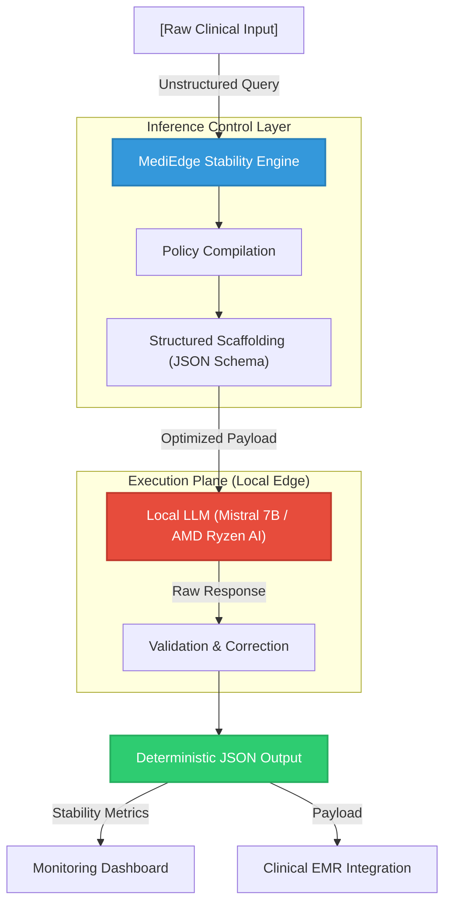

# MediEdge Benchmark Suite

MediEdge is a **Clinical Stability Layer** for deterministic inference on edge devices. It ensures that small language models (like Mistral 7B) behave predictably within clinical software environments by enforcing structure and reducing variance.

## 🚀 Key Features
- **Deterministic Inference Control**: Forces structured JSON output for clinical reliability.
- **Multidimensional Benchmarking**: Tracks tokens, latency, Shannon entropy, and word diversity.
- **Stability Monitoring**: Multi-run variance testing with standard deviation tracking.
- **Automated Reporting**: Generates aggregate metrics and visual entropy heatmaps.

## 📊 Performance Summary
- **Token Reduction**: ~61% through structured prompting.
- **Latency Jitter**: Reduced by ~76% (Higher predictability).
- **Efficiency**: ~87% improvement in Power Proxy (latency × tokens).

## 🏗️ Architectural Workflow



## 🛠️ Components
- `mediedge_benchmark.py`: Core benchmarking engine with 20 diverse clinical cases.
- `mediedge_benchmark_dashboard.py`: Interactive Streamlit dashboard for real-time visualization.
- `docs/`: Supplementary research and simulation notes.

## 📦 Installation
```bash
pip install ollama streamlit openai tiktoken matplotlib numpy reportlab seaborn pydantic
```

## 🏃 Execution
1. **Benchmark Engine**:
   ```bash
   python mediedge_benchmark.py
   ```
2. **Interactive Dashboard**:
   ```bash
   streamlit run mediedge_benchmark_dashboard.py
   ```

## 📄 Documentation
See [AMD_Slingshot_Submission.md](AMD_Slingshot_Submission.md) for the full contest submission details.
